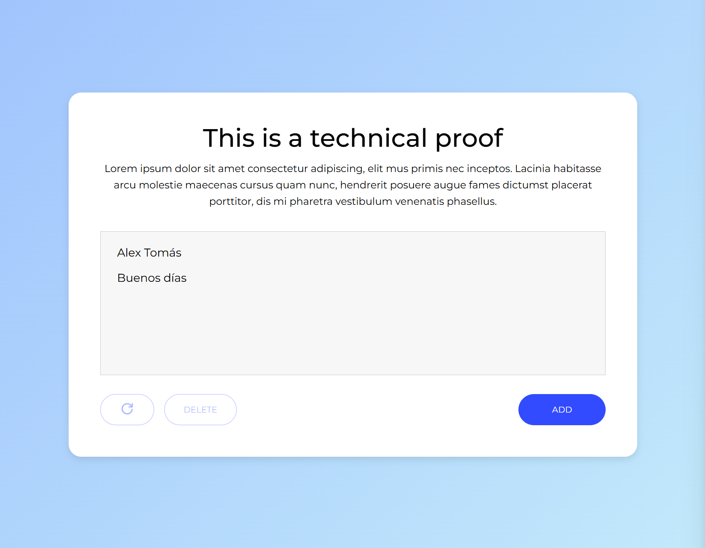
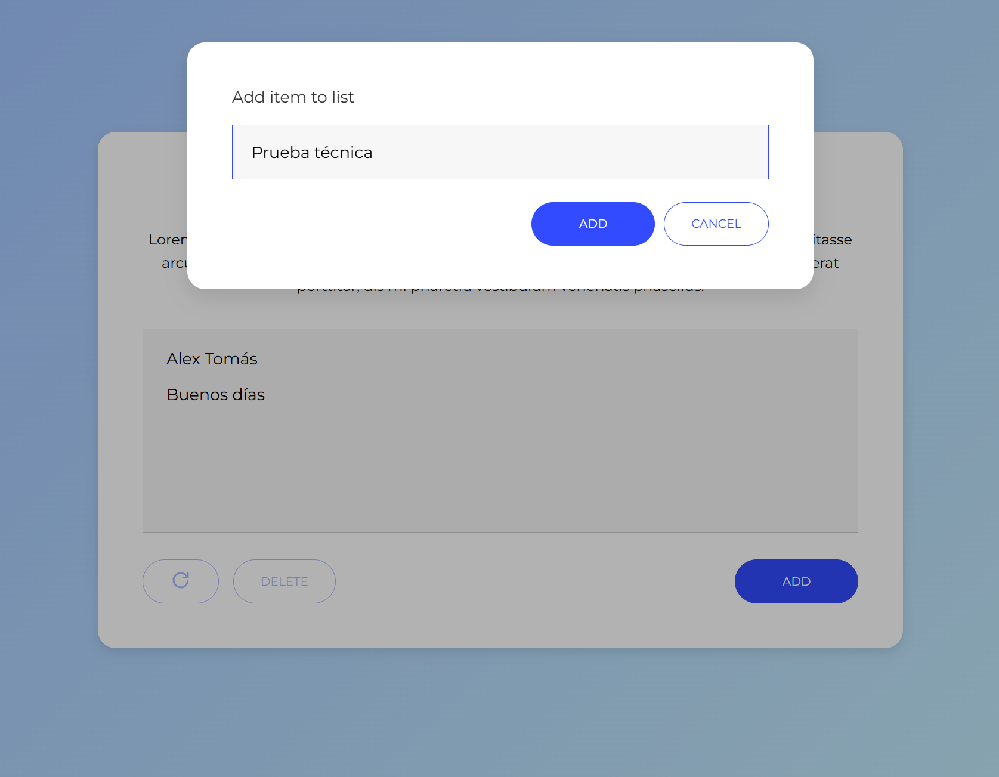

# Logitravel – Prueba técnica React

Aplicación SPA desarrollada con React 19, TypeScript y Vite que permite gestionar un listado de strings mediante un modal de creación, selección múltiple, borrado y restauración.

Todo el estado global se controla con Zustand y cada bloque de UI se implementa como un componente autocontenible con su hoja de estilos en SCSS.

## Funcionalidades

- Visualización del listado de strings.
- Creación de nuevos strings a través de un modal, que valida entradas vacías.
- Eliminación múltiple de los strings seleccionados y restauración de los últimos eliminados.
- Store con Zustand para la gestión del estado de la aplicación.

## Stack

- **Framework:** React + TypeScript.
- **Bundler:** Vite 7 con React Compiler habilitado.
- **Estado global:** Zustand, con middleware `devtools`.
- **Estilos:** SCSS.
- **Testing:** Vitest + @testing-library/react + @testing-library/jest-dom (unitario y de componentes).

## Estructura relevante

```
src/
├─ components/        # UI reutilizable (controls, modal, list items…)
├─ store/             # Zustand store (`useStringListStore.ts`)
├─ assets/            # Iconografía SVG/TSX
├─ styles/            # Variables globales SCSS
├─ App.tsx            # Composición principal de la vista
└─ main.tsx           # Entrada Vite/React
```

## Scripts disponibles

| Comando        | Descripción                                                        |
| -------------- | ------------------------------------------------------------------ |
| `pnpm dev`     | Levanta el servidor de desarrollo con HMR (http://localhost:5173). |
| `pnpm build`   | Compila TypeScript y genera la build optimizada en `dist/`.        |
| `pnpm preview` | Sirve la build resultante para validación previa a producción.     |
| `pnpm lint`    | Ejecuta ESLint sobre todo el proyecto.                             |
| `pnpm test`    | Corre la suite de Vitest en modo watch/CI según el entorno.        |

## Pruebas y cobertura

- Las pruebas unitarias se encuentran junto a cada componente/store (`*.test.tsx` / `*.test.ts`).
- Para generar cobertura: `pnpm test -- --coverage`. El reporte HTML se escribe en `coverage/`.

## Screenshots




